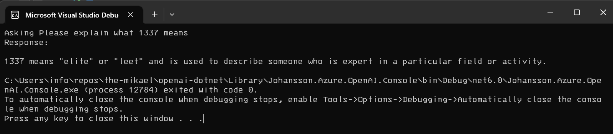

# OpenAI library for .NET

A quick implementation of Azure Open AI Service. Following the
[Open AI specification](https://platform.openai.com/docs/api-reference/introduction).


# Quick start

// TODO: Create NuGet

From Visual Studio, create a Console Application project. In the Program.cs add the following:

```csharp
using Johansson.OpenAI;

const string Prompt = "Please explain what 1337 means";

Console.WriteLine($"Asking {Prompt}");

var openAi = new OpenAi("https://<enter your service name here>.openai.azure.com/", "<enter your api key here>");
var response = await openAi.Completions.GenerateAsync(
    "<enter your deployment name here>",
    Prompt);

Console.WriteLine($"Response: {response.FirstChoice()}");
```

Example output:




# API Reference


